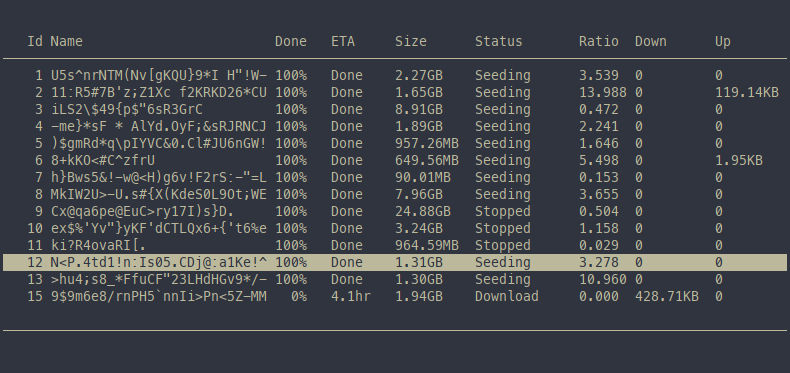
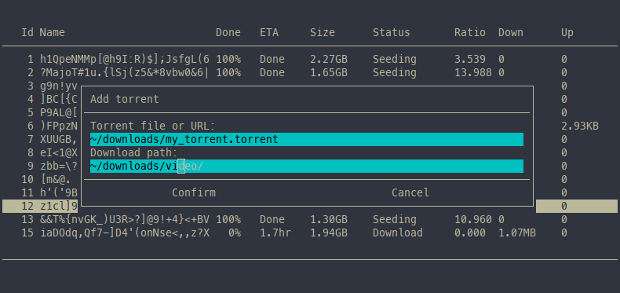
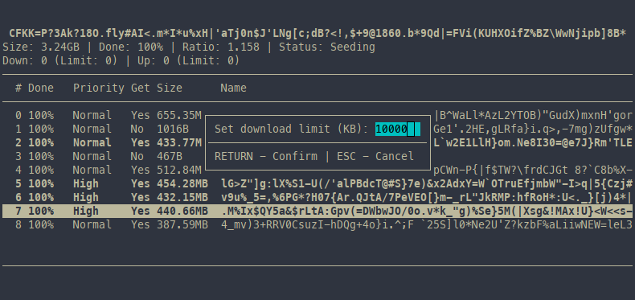

# transmission-go

Feature-poor ncurses-based `transmission-daemon` client.

## Reason

I wanted to learn some Go and do something useful in the process. Having an affinity for terminal and CLI tools, I figured this would be a nice project that I might be using on a daily basis myself.

The client currently has a bare minimum of the daemon/remote client features. Feel free to request/add more.

## Features/screens

(For obvious reasons all torrent/filenames are obfuscated)

List of active torrents.




Torrent details.




## Usage

### Launch Arguments

`-h` -- hostname to connect to; default: `localhost`

`-p` -- port number; default: `9091`

`-o` -- obfuscate all torrent and filenames (added this just for making screenshots)

### Controls

All of the actions on torrents and files work either with current selection (if it's not empty) or with an item under the cursor.

##### List screen

| Keys  | Action |
|-------|--------|
| F1    | Show cheatsheet |
| q     | Exit |
| jk↑↓  | Move cursor up and down |
| l→    | Go to torrent details |
| a     | Add new torrent |
| Space | Toggle selection |
| c     | Clear selection |
| A     | Select all items |
| i     | Invert selection |
| d     | Remove torrent(s) from the list (keep data) |
| D     | Delete torrent(s) along with the data |
| p     | Start/stop selected torrent(s) |
| L     | Set global download speed limit |
| U     | Set global upload speed limit |
| m     | Move selected torrent(s) to a new location |

##### Details screen

| Keys  | Action |
|-------|--------|
| F1    | Show cheatsheet |
| qh←   | Go back to torrent list |
| jk↑↓  | Move cursor up and down |
| Space | Toggle selection |
| c     | Clear selection |
| A     | Select all items |
| i     | Invert selection |
| g     | Download/Don't download selected file(s) |
| p     | Change priority of selected file(s) |
| L     | Set torrent's download speed limit |
| U     | Set torrent's upload speed limit |
| m     | Move torrent to a new location |

## Building

Obviously requires a working Go environment and headers/libs for ncurses. To properly support wide characters, I link against `ncursesw`

Building should be pretty straightforward:
```
make
```
Or
```
go build
```

## Installation
```
make install
```
Default install path of `usr/local/bin` can be changed by passing `INSTALL_DIR=/your/dest/path` to the `make` command.

## Contributions

Feel free to use, modify, report bugs, create feature requests or pull requests.

## Acknowledgements

Wide-char support: [GeertJohan/cgo.wchar](https://github.com/GeertJohan/cgo.wchar)

Goncurses: [rthornton128/goncurses](https://github.com/rthornton128/goncurses). I had to modify it a little to expose wide-character functions of ncurses.

## License

GPLv3
